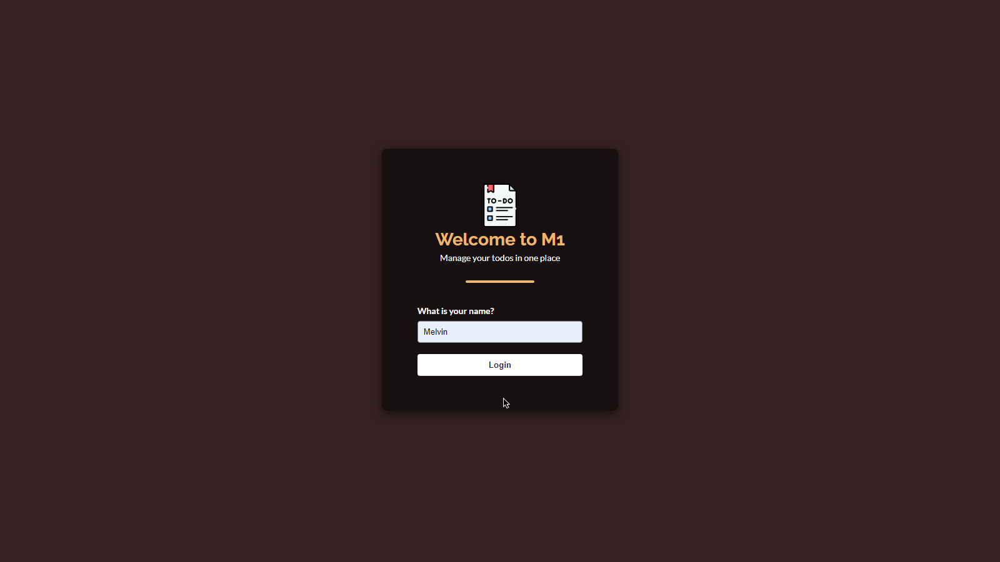
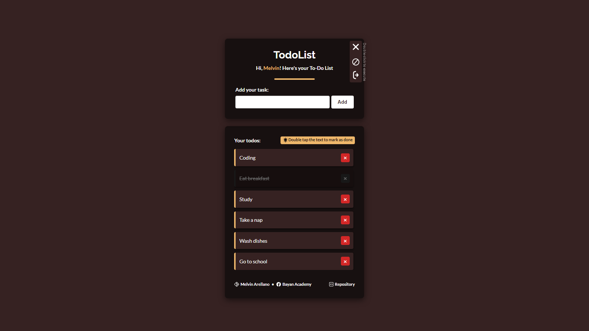

# TODO List Project
Project for JavaScript Training from Bayan Academy. This project was made with pure three foundation of web development which are the HTML, CSS, and JavaScript

## Features
This simple project includes:
* Login page where the user can enter their name to be displayed in home page
* Todo tasks are save in localhost
* Double click to mark as done
* Delete the task by clicking the [x] button
* Drop down menu for logging out and clearing all the tasks
* Simple footer
* Mobile-first Design

### Login

### Home

Thank you Bayan Academy!
